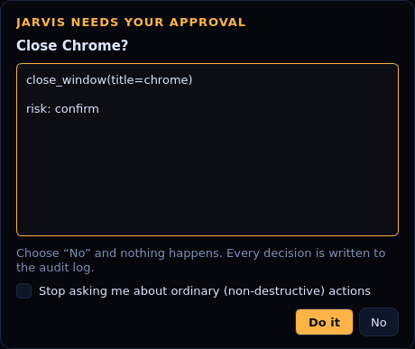

# Code-Jarvis

**JARVIS — a local-first voice assistant for your desktop, with a developer copilot built in.**

Talk to it, type to it, or let it watch your clipboard. It answers out loud, remembers what you
tell it, reviews your code, draws flowcharts of it, and generates reproducible test datasets —
**with no API key required**. Plug in a Groq/OpenAI key or run Ollama locally and the same
assistant starts answering open-ended questions too.


---

## Contents

- [What it does](#what-it-does)
- [Quick start](#quick-start)
- [Talking to it](#talking-to-it)
- [Voice setup](#voice-setup)
- [Adding a language model (optional)](#adding-a-language-model-optional)
- [The skills](#the-skills)
- [Computer control](#computer-control)
- [Routines and habits](#routines-and-habits)
- [Developer tools](#developer-tools)
- [Command line](#command-line)
- [Where your data lives](#where-your-data-lives)
- [Architecture](#architecture)
- [Tests and linting](#tests-and-linting)
- [Troubleshooting](#troubleshooting)
- [Security note](#security-note)
- [Roadmap](#roadmap)
- [Project history](#project-history)
- [License](#license)

---

## What it does

| Area | Examples |
| --- | --- |
| 🎙 **Voice** | Say *"Jarvis, what's my battery at?"* — or enable the wake word and leave it listening. |
| 🧠 **Memory** | *"note that the staging DB rotates on Monday"*, *"add task call the bank"*, *"remember my locker code is 4417"*. |
| ⏰ **Timers** | *"remind me in 25 minutes to stretch"* — speaks up and shows a notification when it fires. |
| 💻 **Code review** | *"review app.py"* / *"review my clipboard"* — offline lint + AST analysis: secrets, `eval`, bare `except`, mutable defaults, injection, complexity, unused imports… |
| 📊 **Flowcharts** | *"make a flowchart of jarvis/core.py"* — Mermaid + Graphviz output saved to disk. |
| 🧪 **Synthetic data** | *"generate 500 rows of patient data as csv"* — deterministic (seedable) datasets in CSV/JSON/JSONL/SQL. |
| 📰 **Briefing** | *"brief me"* — time, tasks, weather and system state in one answer. |
| 🌤 **Weather** | *"will it rain today in Chennai"* — Open-Meteo, no key needed. |
| 📚 **Knowledge** | *"who was Ada Lovelace"* — Wikipedia summaries offline-safe, or the LLM when configured. |
| 🖥 **System** | *"system status"*, *"how much battery is left"*, *"top processes"*, *"free up my disk"* info. |
| 🖱 **Computer control** | *"open chrome"*, *"type hello world"*, *"press save"*, *"click the save button"*, *"snap chrome to the left"*, *"next song"*, *"turn off wifi"*, *"lock my screen"*. |
| 🧩 **Plans** | *"open chrome, then set the volume to 20, then read my screen"* — run in order, with the plan shown for approval when it is long. |
| 🔁 **Routines** | *"watch what I do"* … *"save that as work session"* … *"run my work session"*. Learned habits are offered back to you. |
| 🎛 **Media & apps** | *"volume up"*, *"open chrome"*, *"search youtube for lofi beats"*. |
| 📋 **Clipboard & screen** | *"what's on my clipboard"*, *"take a screenshot"*. |
| 🗂 **Files & repos** | *"find file config.json"*, *"how big is ~/projects"*, *"git status"*, *"list the TODOs in this repo"*. |

Everything in that table works **offline and key-free**. It will never invent an answer it
cannot back up: when a request is outside its skills and no model is configured, it says so and
points you at `/help`.

## Quick start

```bash
git clone https://github.com/git-aditya3/Code-Jarvis.git
cd Code-Jarvis

python -m venv .venv
source .venv/bin/activate        # Windows: .venv\Scripts\activate

pip install -r requirements.txt  # optional but recommended
python run_jarvis.py
```

That is the whole install. If you would rather not install anything yet:

```bash
python run_jarvis.py --doctor    # what is available on this machine?
python run_jarvis.py --chat      # text chat, no GUI needed
python run_jarvis.py --ask "what is 18% of 2400"
```

**Requirements:** Python 3.10+. Nothing else is mandatory — JARVIS degrades gracefully and
`--doctor` tells you exactly which optional package unlocks which feature.

> **Want to see it before installing anything?** `python tools/preview_server.py` serves a browser
> preview of the interface: the live HUD animation rendered from the real Qt widget, the actual
> skill router answering your questions, and screenshots of the desktop app.

## Talking to it

| Shortcut | Action |
| --- | --- |
| `Ctrl` `Space` | Focus the command box |
| `Ctrl` `M` | Hold a conversation with the microphone |
| `Ctrl` `B` | Run the daily briefing |
| `F1` | List every skill |
| `↑` / `↓` in the box | Recall previous commands |
| `Esc` | Hide to the system tray |
| `Ctrl` `Q` | Quit |

Slash commands work in the box, the tray, and the terminal:

```
/help              list every skill
/status            diagnostics: brain, voice, memory
/brief             time + tasks + weather + system
/timers            what is counting down
/memory            memory stats  (/memory export writes a text file)
/clear             clear the conversation (notes and tasks are kept)
/provider groq     switch brain
/llm on|off        quick brain toggle
/voice on|off      spoken replies
/settings          jump to the Settings tab
/quit
```

Useful phrasing:

```
review app.py                          what's on my clipboard
explain jarvis/core.py                 make a flowchart of jarvis/core.py
generate 1000 rows of logs as jsonl    find file config.json in ~/projects
brief me                               remind me in 10 minutes to check the build
note that the demo is Friday           what are my tasks
remember my project is called Jarvis   what do you remember about my project
```

## Voice setup

Voice is optional and auto-detected. Install whichever halves you want:

```bash
pip install pyttsx3                      # 🗣 speech out — uses the OS voice
pip install sounddevice faster-whisper   # 👂 speech in + wake word — fully offline
```

- **Speech out** falls back automatically in this order: `pyttsx3` → Qt text-to-speech (ships
  with PyQt6) → the OS command (`say` on macOS, PowerShell speech on Windows, `espeak` on Linux).
  Pick a specific voice and rate in **Settings → Voice**.
- **Speech in** uses `faster-whisper` locally (no cloud, no key). `vosk` and Google's web API via
  `SpeechRecognition` are supported as alternatives.
- **Wake word** (*"Jarvis, …"*) is a toggle in Settings. It listens in the background with an
  energy gate, tolerates slight mispronunciations ("jarvus", "jarviz"), and can take the rest of
  the sentence in the same breath: *"Jarvis, what's the weather"*.
- **Camera-shy?** Everything voice-related can stay switched off; the text interface is complete.

## Adding a language model (optional)

JARVIS is fully usable without one. With a model configured, anything outside the skill set
becomes answerable, and the code-review and explain skills get a second, deeper pass.

| Provider | How | Notes |
| --- | --- | --- |
| **Groq** | paste a key in **Settings → Language model** | Free tier; very fast. `llama-3.3-70b-versatile` by default. |
| **OpenAI** | paste a key | `gpt-4o-mini` by default. |
| **Ollama** | `ollama serve` + `ollama pull llama3.1` | 100% local and private; nothing leaves your machine. |

Keys are read from the environment first, then from settings:

```bash
export GROQ_API_KEY="..."     # powershell: $env:GROQ_API_KEY="..."
export OPENAI_API_KEY="..."
```

There is **no key in the source code** — see [Security note](#security-note).

## The skills

27 skills ship by default. Run `--skills` or `/help` for the live list; each one is a small class
in [`jarvis/skills.py`](jarvis/skills.py), [`jarvis/dev_skills.py`](jarvis/dev_skills.py) and
[`jarvis/control_skills.py`](jarvis/control_skills.py) that declares regex patterns, a weight and a
`run()` method, so adding your own is a dozen lines.

| Skill | Ask it |
| --- | --- |
| Clock | `what's the time`, `date in Tokyo` |
| Calculator | `calculate 15*240+8`, `what is 18% of 2400`, `convert 12 km to miles` |
| Weather | `weather`, `will it rain today`, `forecast for Chennai` |
| Knowledge | `who was Ada Lovelace`, `what is quantum entanglement` |
| Network | `is the internet up`, `what's my ip` |
| System monitor | `system status`, `battery`, `top processes` |
| Media keys | `volume up`, `mute`, `next track` |
| Power | `lock my screen` (shutdown is deliberately left to you) |
| Launcher | `open chrome`, `open downloads`, `search youtube for lofi` |
| Notes / tasks / facts | `note that …`, `add task …`, `what are my tasks` |
| Timers | `set a timer for 10 minutes`, `list timers`, `cancel all timers` |
| Clipboard | `what's on my clipboard`, `copy hello world to clipboard` |
| Screenshot | `take a screenshot` |
| Briefing | `brief me`, `good morning` |
| Files | `find file config.json`, `read ~/notes.md`, `summarise report.md`, `list files in ~/Downloads` |
| Project insight | `git status`, `what changed in this repo`, `list the TODOs` |
| Environment | `what python am i running`, `is docker installed` |
| Diagnostics | `status`, `/status` |

## Computer control

JARVIS can drive the machine it runs on — **75 actions**, all reachable by voice, from the
command line, or as a step inside a plan or routine. Every one of them reports honestly what it
did, and everything risky passes a policy check first.

| Group | Things you can say |
| --- | --- |
| **Apps** | *"open chrome"*, *"switch to slack"*, *"close spotify"*, *"what apps are open"*, *"open my downloads"*, *"open notes.pdf"* |
| **Windows** | *"minimise chrome"*, *"maximise this window"*, *"make this window fullscreen"*, *"snap chrome to the left"*, *"keep chrome on top"*, *"show me the desktop"*, *"go to workspace 2"*, *"move chrome to 0,0 1920x1080"*, *"next window"* |
| **Keyboard** | *"type hello world"*, *"press ctrl+shift+t"*, *"press save"*, *"hit undo"*, *"press print"*, *"what shortcuts do you know"* |
| **Mouse** | *"click"*, *"double click"*, *"right click"*, *"click at 400,300"*, *"drag from 100,100 to 500,400"*, *"scroll down 5"*, *"where's the pointer"*, *"click the save button"* (finds the label on screen with OCR and clicks it) |
| **Screen** | *"read my screen"*, *"take a screenshot"*, *"find the save button on my screen"*, *"copy what's on my screen"*, *"what's my screen resolution"* |
| **Sound & display** | *"set the volume to 30"*, *"volume down 15"*, *"mute"*, *"next song"*, *"pause"*, *"brightness 40"*, *"dim the screen"*, *"make the screen brighter"* |
| **System** | *"lock my screen"*, *"sleep"*, *"shut down"*, *"restart"*, *"log out"*, *"turn off wifi"*, *"turn on dark mode"*, *"enable night light"*, *"power saving mode"*, *"empty the trash"*, *"open a terminal"* |
| **Processes** | *"what's running"*, *"is chrome running"*, *"kill spotify"*, *"start notepad"* |
| **Files** | *"list files in ~/Downloads"*, *"find all pdf files in downloads"*, *"read notes.txt"*, *"add buy milk to ~/todo.txt"*, *"make a folder called drafts"*, *"copy a.txt to ~/Documents"*, *"rename report.md to final.md"*, *"duplicate report.md"*, *"zip ~/project"*, *"extract backup.zip"*, *"delete ~/junk.txt"*, *"how big is that folder"*, *"how much disk space is left"* |
| **Clipboard & memory** | *"read my clipboard"*, *"copy hello to my clipboard"*, *"what did i copy earlier"*, *"put back what i copied"*, *"remember my locker code is 4417"*, *"note that …"*, *"add task …"* |
| **Shell** | *"run git status"*, *"run ls -la"*, *"run the command docker compose up"*, *"in the terminal run make test"* |
| **Assistant** | *"what can you control"*, *"what did you just do"*, *"notify me the build finished"*, *"say good morning"*, *"remind me in 10 minutes"* |

Multi-step requests become **plans**: *"open chrome, then set the volume to 20, then read my
screen"*. Each step is parsed offline, the whole plan is shown before it runs when it has six or
more steps, and every step still goes through the policy check. If a clause cannot be parsed and
you have configured a language model, JARVIS asks it for a JSON plan — validated against the
action registry, so a model can *suggest* a step but never invent one.



### Safety

Control is powerful, so the rules are explicit and visible in code
([`jarvis/actions.py`](jarvis/actions.py)):

| Tier | Meaning |
| --- | --- |
| `safe` | reading and reporting: list windows, read the clipboard, get the volume |
| `confirm` | changes something ordinary: typing, clicking, opening, moving files |
| `dangerous` | destructive or system-wide: shutdown, deleting, emptying the trash, running a shell |
| `refused` | never runs: disk formatting, `rm -rf /`, fork bombs, `curl … \| sh`, password stores |

- **Trust level** (`ask_all` / `ask_risky` / `trusted`) decides how often you are asked.
  Dangerous actions always ask, and need “Allow destructive actions” switched on as well.
- **Every decision is logged** to `~/.jarvis/audit.log` (JSONL: action, redacted arguments,
  risk, outcome), so *"what did you just do"* is always answerable.
- **Sensitive paths** (`~/.ssh`, `~/.aws`, keychains, browser credential stores) and **system
  directories** (`/usr`, `/etc`, `C:\Windows`, `/System`, …) cannot be written to or deleted.
- **Fail closed**: if the front-end cannot ask you, the action is refused rather than run.
- **Dry run** (`--dry-run`, or the Settings checkbox) rehearses a whole routine without touching
  the machine — every reply is marked `[simulation]`.
- **Voice-only mode**: with *Ask out loud for risky actions* enabled, JARVIS says what it wants to
  do and waits for a spoken “yes” (or “no”) instead of showing a dialog.
- Clipboard history deliberately **drops anything that looks like a key or token**.

### What each platform needs

```bash
python -m jarvis --doctor      # shows what is ready and what needs installing
```

| Platform | Backends used | Install |
| --- | --- | --- |
| Linux (X11) | `xdotool`, `wmctrl`, `pactl`/`amixer`, `brightnessctl`, `playerctl`, `nmcli` | `sudo apt install xdotool wmctrl pulseaudio-utils brightnessctl` |
| macOS | built-in `osascript`, `screencapture`, `networketup`; optional `cliclick` | grant Accessibility + Screen Recording |
| Windows | `ctypes` SendInput, PowerShell; optional `pycaw` for exact volume levels | `pip install pycaw` |
| Screen reading | `tesseract-ocr` + `pytesseract` | `sudo apt install tesseract-ocr` |
| Mouse/keyboard (headless Linux) | needs an X11/XWayland session | — |

Anything the machine cannot do is reported as such — JARVIS says *why* and what to install rather
than pretending the action worked.

## Routines and habits

Complex tasks are worth remembering.

```text
you › watch what I do
you › open chrome
you › set the volume to 20
you › run git status
you › stop recording
you › save that as morning setup
you › run my morning setup          # any time, by voice
```

- A recording of two or more steps can be **saved as a named routine** and stored in memory
  (`~/.jarvis/memory.json`), so it survives restarts and shows up in the Memory tab.
- JARVIS also **watches for habits**: do the same two or three things together a couple of times
  and it offers to save them as a routine. *"what have you noticed"* asks on demand, and
  *"delete routine morning setup"* forgets one.
- Routines run through the same safety layer as single actions: long routines are shown for
  approval first, and each step that needs confirmation still asks.
- Rehearsals stay out of the habit data: with dry-run on, the steps you *teach* are recorded, but
  nothing you merely simulate counts as something you do often.

## Developer tools

The original point of this repository — code assistance — is now the strongest part of the
assistant, and it no longer needs OCR, a screenshot or an API key.

**Review** (`review app.py`, `review my clipboard`, or paste code after a colon)

- Secrets: Groq/OpenAI/AWS/Google/GitHub token patterns and hard-coded credentials
- Danger: `eval`/`exec`, `os.system`, `shell=True`, `pickle.loads`, `innerHTML`, `gets`, `strcpy`,
  SQL built by string interpolation
- Python AST pass: bare/`except Exception: pass`, mutable default arguments, `== None`,
  `range(len(x) - 1)` off-by-ones, `while True` with no `break`, long functions, high cyclomatic
  complexity, unused imports, docstring coverage
- Output as a readable summary **or** a Markdown table you can paste into a pull request

**Flowcharts** (`make a flowchart of jarvis/core.py`) walk the real AST — functions, branches,
loops, `try/except`, returns — and emit Mermaid (renders on GitHub, in VS Code, in Obsidian) plus
Graphviz DOT, with PNG rendering when `graphviz` is installed.

**Synthetic data** (`generate 500 rows of patient data as csv`) covers users, transactions, health,
logs, employees and sensors, with a `seed` for reproducible fixtures:

```bash
python run_jarvis.py --ask "generate 200 rows of payment data as sql seed 7"
```

## Command line

```
python run_jarvis.py                     # desktop window (default)
python run_jarvis.py --ask "TEXT"        # one-shot answer, script friendly
python run_jarvis.py --chat              # terminal chat
python run_jarvis.py --skills            # list skills
python run_jarvis.py --doctor            # dependency + voice diagnostics
python run_jarvis.py --provider ollama --model qwen2.5    # one-off overrides
python run_jarvis.py --no-voice --data-dir ./sandbox      # quiet, isolated run
python tools/preview_server.py --port 8077               # browser preview of the interface
```

## Where your data lives

Everything is local, in `~/.jarvis` (override with `JARVIS_HOME`):

```
~/.jarvis/
├── settings.json      user preferences (0600 — includes any saved API key)
├── memory.json        notes, tasks, facts, conversation history
├── audit.log          every action JARVIS took, with redacted arguments
├── routines.json      recently observed steps (habit detection)
├── clipboard.json     the last 20 clipboard entries (secrets are skipped)
├── diagrams/          generated .mmd / .dot / .png flowcharts
├── synthetic/         generated datasets
└── screenshots/       captured screenshots
```

Nothing is uploaded anywhere. The only network calls JARVIS ever makes are the ones you ask for:
weather, Wikipedia, your configured LLM provider, and the public-IP lookup. Delete the folder and
JARVIS forgets everything.


## Architecture

```
run_jarvis.py ──► jarvis/run.py ──► jarvis/ui/main_window.py  (Qt window, HUD)
                                        │
                                        │  implements Host
                                        ▼
   jarvis/core.py ──► jarvis/brain.py       (Groq / OpenAI / Ollama)
        │        ──► jarvis/skills.py       (offline skills)
        │        ──► jarvis/dev_skills.py   (code review, data, diagrams, files, git)
        │        ──► jarvis/memory.py       (notes / tasks / facts / history)
        │        ──► jarvis/voice.py        (TTS, STT, wake word)
        └───────► jarvis/analyzers.py, synthetic.py, flowchart.py
```

Two ideas keep it simple and testable:

1. **The core never imports Qt.** Skills talk to a `Host` — six methods for notifications,
   speech, clipboard, screenshots, opening things and scheduling. The desktop window implements
   `Host`; `HeadlessHost` implements it for the CLI and the test suite.
2. **Every answer is honest about its source.** `Core.ask()` tries slash commands → offline
   skills → the configured LLM → and finally says plainly that it cannot help offline. Each
   reply carries the skill that produced it, which the transcript shows as a small label.

Request flow for `"jarvis, review my clipboard"`: strip wake word → route to the highest-weighted
skill (`clipboard_review`, weight 0.99) → run it → reply rendered in the transcript, spoken
aloud, and stored in conversation history for the next turn's context.

## Tests and linting

```bash
python -m unittest discover -s tests -v    # 128 tests, no network, no real home dir touched
ruff check .                               # configured in pyproject.toml
```

The suite covers routing and skill selection, memory persistence, timer firing, the analyser rule
set, deterministic dataset generation, flowchart generation, wake-word matching, the safe
arithmetic evaluator, settings/key handling and the `Host` contract — plus the control layer: the
phrase grammar, the policy tiers, dry-run execution, the audit log, plan parsing, routine
recording and replay, habit detection, the GUI thread marshaller and zip-slip protection.

## Troubleshooting

| Symptom | Fix |
| --- | --- |
| Window does not open | `pip install PyQt6`; on headless Linux use `--chat` |
| No speech | `pip install pyttsx3`, or pick a different engine in Settings. Try PyQt6's built-in engine (`qt`). |
| Mic button does nothing | `pip install sounddevice faster-whisper`, then **Re-check voice** |
| Wake word never triggers | Check the wake word in Settings; try "Hey Jarvis". It needs a mic level above the noise gate. |
| LLM answers nothing | Settings → **Test connection**; check the key is saved and the provider matches |
| No PNG for flowcharts | `pip install graphviz` **and** the system Graphviz (`dot`) — Mermaid output works without it |
| Weather fails | No internet, or a city name Open-Meteo cannot geocode — try a larger nearby city |
| Where is my data? | `~/.jarvis`; open it from Settings → Data |
| "I cannot … windows" | Install the helpers: `python -m jarvis --doctor` says exactly what is missing |
| Actions do nothing | They may be in dry-run mode — the status bar shows `DRY RUN` |

## Security note

⚠️ **The original `code assistance.py` in this repository contained a live Groq API key
hard-coded at line 43.** It has been removed and the script now reads the key from the
environment, but the old key is in the git history and **must be revoked** at
[console.groq.com/keys](https://console.groq.com/keys). Treat any key that has ever been
committed as compromised.

How JARVIS handles secrets now:

- no credentials in the source, ever;
- `GROQ_API_KEY` / `OPENAI_API_KEY` from the environment take precedence over anything stored;
- keys saved through Settings land in `~/.jarvis/settings.json` with `0600` permissions
  (and `~/.jarvis` is never inside this repository);
- the offline code reviewer actively flags committed credentials, so the same mistake gets
  caught next time.

## Roadmap

- [ ] Wake-word model with an always-on low-power detector (currently energy-gated listening)
- [x] Computer control by voice (75 actions, plans, routines, audit log)
- [x] Screen reading and OCR clicking (`read my screen`, `click the save button`)
- [ ] Calendar and email skills (ICS first, so it stays key-free)
- [ ] Plugin folder so third-party skills can be dropped in without editing the repo
- [ ] Packaging: `pipx install code-jarvis`, plus a standalone PyInstaller build

## Project history

This started as `code assistance.py` — a Windows-only PyQt6 overlay that OCR'd your screen every
five seconds and sent the extracted code to an LLM. That script is still here (it now reads its
key from the environment), but the idea has been reshaped into a real assistant: the screen-OCR
review loop became an offline analyser plus a clipboard skill, the hard-coded key became a
pluggable provider, and the overlay became a voice-first HUD with memory, skills and tests.

## License

MIT — see [LICENSE](LICENSE).
